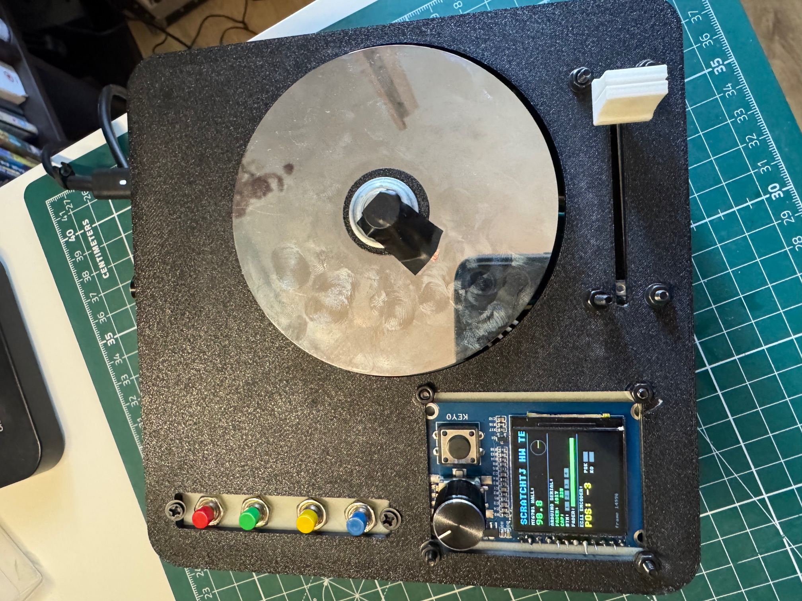
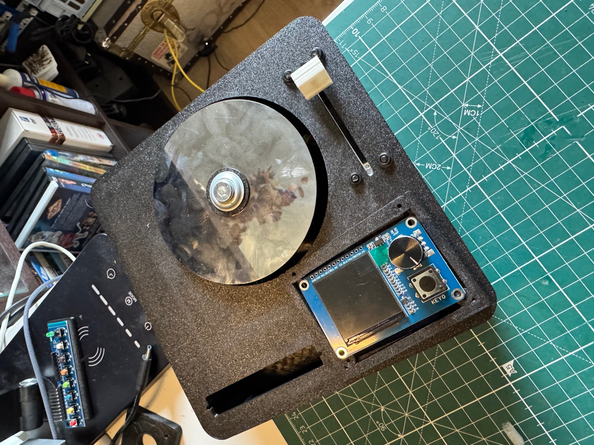
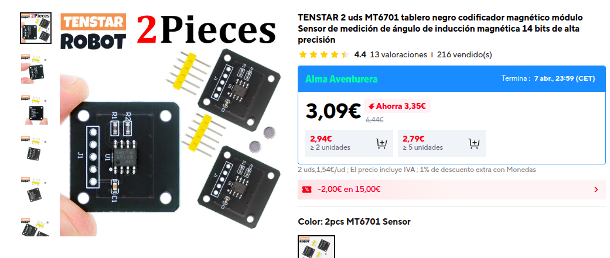
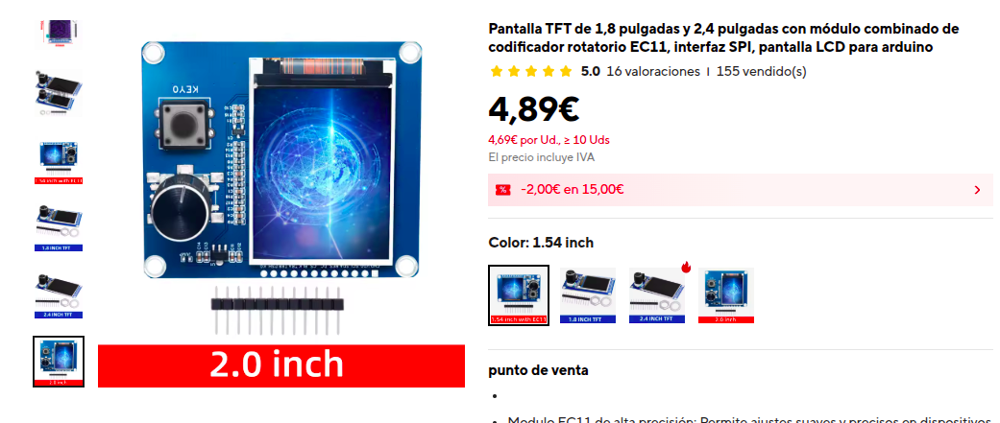
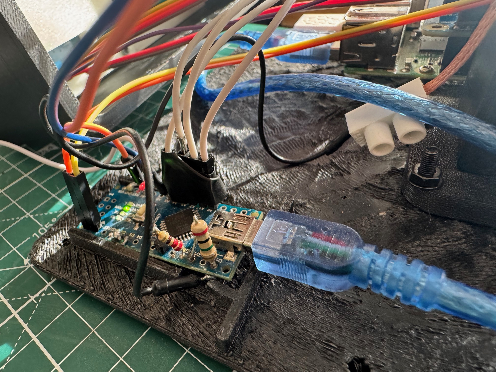
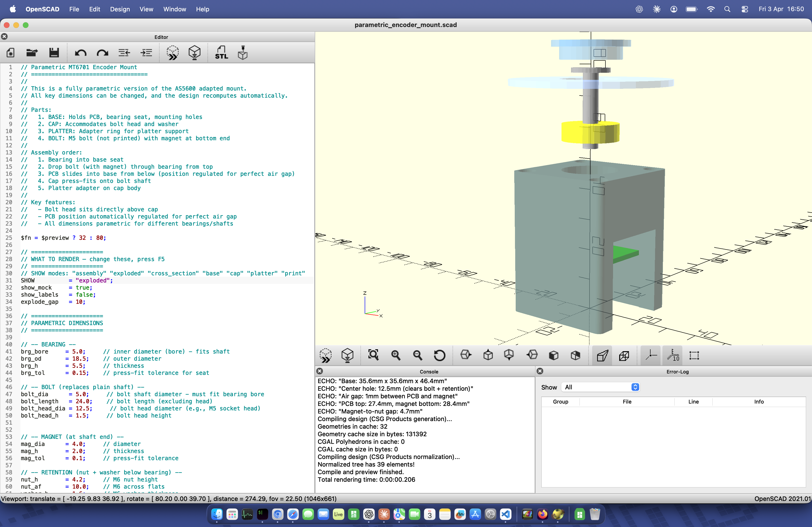

# ScratchTJ MK2 -- DIY Digital Scratch Turntable

A fully open-source portable scratch instrument built around a Raspberry Pi, Arduino Nano, and the [xwax](http://www.xwax.co.uk/) digital vinyl emulation engine.

This project is based on the work by **[the_rasteri](https://github.com/rasteri)** and the [SC1000](https://github.com/rasteri/SC1000) open-source portable turntable. The software is a fork of the SC1000 codebase, and the hardware design draws heavily from that project. Without rasteri's original work, ScratchTJ would not exist.

> **Project status:** this repository tracks **MK2**.
> The previous generation is preserved in Git tag **`mk1`**.

**[Full Build Guide](docs/BUILD_GUIDE.md)** -- step-by-step wiring, assembly, and component documentation.



[](https://youtu.be/LH9r2fsUk-c?si=Gcfz0AI6pA22WaxF)

## Features

- Two independent decks: beats + scratch sample, mixed through a DJ fader
- MT6701 magnetic angle sensor for high-precision platter tracking (MK2 upgrade from 600 PPR optical)
- ST7789 240x240 TFT display with rotary encoder menu navigation
- Touch-sensitive HDD platter with capacitive sensing
- Four cue buttons via Arduino (A0--A3) with short-press jump and long-press set
- Live input recording from ALSA capture devices
- Preset system to save and load all settings
- Binary serial protocol at 500 kbaud between Arduino and Pi
- All key parameters tunable in real time from the menu
- Pitch mode via rotary encoder long press



[](https://youtu.be/6zyM5B6j0_E?si=wSV1pAbMLMZF-k79)

## Architecture

```
+--------------+   Serial 500kbaud   +--------------+   I2S Audio   +-----------------+
| Arduino Nano | ------------------- | Raspberry Pi | ------------ | AudioInjector   |
|              |   7-byte binary pkt |              |              | Sound Card      |
| - Fader      |   (sync+data+XOR)   | - xwax       |              +-----------------+
| - Cap sensor |                     | - TFT menu   |
| - 4 cue btns |                     |              |
+--------------+                     | - MT6701 I2C |
                                     | - Recording  |
                                     +--------------+
```

The Arduino handles the DJ crossfader, capacitive touch sensor, and 4 cue buttons, sending data as 7-byte binary packets with XOR checksum at ~500 Hz. The Raspberry Pi reads the MT6701 magnetic encoder via I2C, runs the audio engine, TFT menu system, and live recording.


## Bill of Materials

- **Raspberry Pi** (2/3/4)
- **AudioInjector Sound Card** (I2S audio HAT)
- **Arduino Nano** (serial at 500 kbaud for fader + cap touch)
- **MT6701 Magnetic Angle Sensor** (I2C, platter position)
- **ST7789 240x240 TFT Display** (SPI, menu UI)
- **Rotary Encoder with Push Button** (menu navigation)
- **60mm DJ Crossfader**
- **HDD Platter** (capacitive touch surface)
- **Cue Buttons** (4x, wired to Arduino A0--A3)
- **Diametric Magnet** (for MT6701 sensing)
- **3D Printed MK2 Enclosure**




## Software Overview

Key source files:

| File | Purpose |
|------|---------|
| `arduino_nano/arduino_nano.ino` | Arduino firmware: fader, cap sensor, cue buttons, binary serial |
| `software/sc_input.c` | Serial reader, MT6701 I2C encoder, platter-to-audio position mapping |
| `software/player.c` | Audio engine with cubic interpolation, pitch filtering, slipmat simulation |
| `software/xwax.c` | Main application, deck init, shared variable registration |
| `software/recording.c` | Live input recording from ALSA capture devices |
| `software/cues.c` | Cue point system with per-track save/load |
| `software/lcd_menu.c` | TFT display, rotary encoder menu navigation |
| `software/deck_menu.c` | Per-deck menu: file browse, transport, cue screen, recording |
| `software/controller_menu.c` | Config menu: Sound Settings, Global Settings, Info |
| `software/preset_menu.c` | Preset save/load/reset system |
| `software/shared_variables.c` | Thread-safe runtime variable system for menu-tunable parameters |

## Menu System

The menu is driven by the EC11 rotary encoder (scroll + push) and the KB0 back button (GPIO 17). The home screen shows a live platter visualization with deck info, fader graph, and cue indicators. 10 seconds of inactivity returns to home.

[](https://youtube.com/shorts/j2CSrozANF8?si=jhMayBKkclHSwKNa)

### Full Menu Tree

```
HOME SCREEN
│  Live platter visual, deck info, fader graph, cue bar
│  Any encoder action → Main Menu
│
├── Deck 2 (hero deck)
│   ├── Start/Stop .............. toggle playback
│   ├── Load File
│   │   ├── Folder Browser ..... scroll folders, KB0 to enter
│   │   └── File Browser ....... scroll files, KB0 to load
│   │       ├── Start/Stop
│   │       ├── Next File
│   │       ├── Previous File
│   │       ├── Random File
│   │       ├── Next Folder
│   │       ├── Previous Folder
│   │       └── Record ......... enter recording workflow
│   ├── Settings
│   │   ├── Jog Pitch Mode ..... toggle pitch bend via platter
│   │   ├── Toggle Jog Reverse . reverse platter direction
│   │   └── Platter Speed ...... adjust encoder-to-audio ratio
│   └── Info ................... filename, path, position, pitch,
│                                volume, touch state, cue points
│
├── Deck 1 (same structure as Deck 2)
│
├── Record Dk2 ................. shortcut to recording workflow
│   ├── Input Source Selection .. list ALSA capture devices
│   ├── Record Setup
│   │   ├── RECORD (start) ..... red indicator, begins capture
│   │   ├── Input .............. Line In / Mic selector
│   │   ├── Gain ............... capture volume (0-31)
│   │   ├── Mic Boost .......... on/off toggle
│   │   └── Passthru ........... output line bypass on/off
│   │   (live input level meter with dB readout)
│   └── Recording .............. live timer, blinking red dot
│                                KB0 = stop, encoder = abort
│
├── Config
│   ├── Sound Settings ......... all ALSA mixer controls
│   │   └── (per control) ...... volume slider, boolean, or enum
│   ├── Global Settings ........ all registered shared variables
│   │   └── (per variable) ..... value adjust with min/max/step
│   │       (fader variables show live curve graph)
│   ├── Save Config ............ writes to ~/.scratchtj/config.cfg
│   └── Reset Defaults ......... restores all to factory values
│
└── Info
    ├── CPU/Mem ................ live CPU and memory usage
    └── Version ................ "ScratchTJ v2" + build date
```

### Navigation Controls

| Control | Action |
|---------|--------|
| Encoder rotate | Scroll through menu items / adjust values |
| Encoder push | Back / cancel / return to previous menu |
| KB0 button (GPIO 17) short press | Select / confirm / enter submenu |
| KB0 button long press | Return to home screen |
| Encoder long press | Enter Pitch Mode (adjust deck playback speed) |
| 4 cue buttons (Arduino A0--A3) | Short press = jump to cue, long press = set cue |

### Runtime-Tunable Parameters

All adjustable live from Config > Global Settings:

| Parameter | Default | Range | Description |
|-----------|---------|-------|-------------|
| Fad Factor | 0.1 | 0.1 - 10 | Fader curve transition point |
| Fad Power | 0.2 | 0.1 - 10 | Fader curve exponent |
| Fad Switch | 1.0 | 0 - 1 | Fader direction (0=normal, 1=reversed) |
| slippiness | 200 | 1 - 3000 | Slipmat simulation feel |
| target_pitch | 15 | 1 - 240 | Position tracking gain |
| brakespeed | 3000 | 1 - 10000 | Stop button deceleration rate |
| platterspeed | 1333 | 1 - 8192 | Encoder-to-audio position ratio |
| blipthreshold | 59 | 50 - 2048 | Encoder glitch rejection threshold |
| pitch_filter | 0.2 | 0.01 - 1.0 | Pitch low-pass filter (0=smooth, 1=instant) |
| cap_threshold | 5000 | 500 - 30000 | Capacitive touch activation level |
| cap_hysteresis | 500 | 0 - 5000 | Touch on/off hysteresis band |

### Serial Protocol

```
Byte:  [0]     [1]     [2]     [3]     [4]     [5]       [6]
       SYNC    fHi     fLo     capHi   capLo   buttons   XOR
       0xAA    ──fader──       ──cap touch──    4-bit     checksum
               (10-bit)        (16-bit)         bitfield  (bytes 1-5)
```

In MK2, the Arduino no longer sends encoder angle data -- the Pi reads the MT6701 directly over I2C. The packet is 7 bytes: sync, fader (2), cap touch (2), cue buttons (1), checksum (1).

Handshake: Pi sends `0x53` ('S'), Arduino replies `'T'`. Watchdog detects 2-second timeouts with DTR hard-reset after 3 consecutive failures.



## Building

### Prerequisites (on the Raspberry Pi)

- GCC, make
- SDL2 development libraries
- ALSA development libraries
- wiringPi

### Compile and Run

```bash
cd ~/ScratchTJ/software
make -j4
sudo LC_ALL=en_GB.utf8 nice -n -19 ./xwax
```

If locale is not set as above, xwax may fail to start correctly.

### Flash the Arduino

Open `arduino_nano/arduino_nano.ino` in the Arduino IDE. Install the `CapacitiveSensor` library, select Arduino Nano, and upload. Both the Arduino firmware and the Pi software must be updated together since they share the binary serial protocol.

Audio samples go in `~/samples/` (scratch deck) and `~/beats/` (beat deck). The paths are configured in `xwax.c`.

[](https://youtube.com/shorts/L9gylG18938?si=5t2caiyyweBquCjl)

## Hardware Test Scripts

Hardware test and diagnostic scripts are in the [`hw_test/`](hw_test/) directory.

## Documentation

- **[Build Guide](docs/BUILD_GUIDE.md)** -- Step-by-step wiring and assembly
- **[Installation](docs/INSTALLATION.md)** -- Software installation details
- **[Software Architecture](docs/SOFTWARE.md)** -- Thread model, subsystems
- **[Enclosure Design](docs/enclosure/ENCLOSURE_DESIGN.md)** -- 3D printable parts
- **[Parametric Encoder Mount](docs/enclosure/parametric_encoder_mount.scad)** -- OpenSCAD source for the MT6701 encoder mount (fully parametric)



## Project History

ScratchTJ started as an adaptation of rasteri's SC1000 to run on a Raspberry Pi with an AudioInjector audio hat, replacing the Olimex A13 and custom PCB with off-the-shelf components (Arduino Nano, standard encoder, DJ fader) and serial communication instead of I2C/SPI.

MK2 replaces the 600 PPR optical encoder with an MT6701 magnetic angle sensor, the 1602A LCD with an ST7789 TFT display, and introduces a redesigned enclosure with better platter support and Hall-sensor alignment.

## License and Attributions

Licensed under GNU GPL v2.

- **[xwax](http://www.xwax.co.uk/)** by Mark Hills -- the digital vinyl emulation engine at the core of this project
- **[SC1000](https://github.com/rasteri/SC1000)** by the_rasteri -- the open-source portable turntable that ScratchTJ is forked from
- **[AudioInjector](http://www.audioinjector.net/)** -- I2S sound card HAT for Raspberry Pi

---

Kiitos paljon ja happy scratching!
