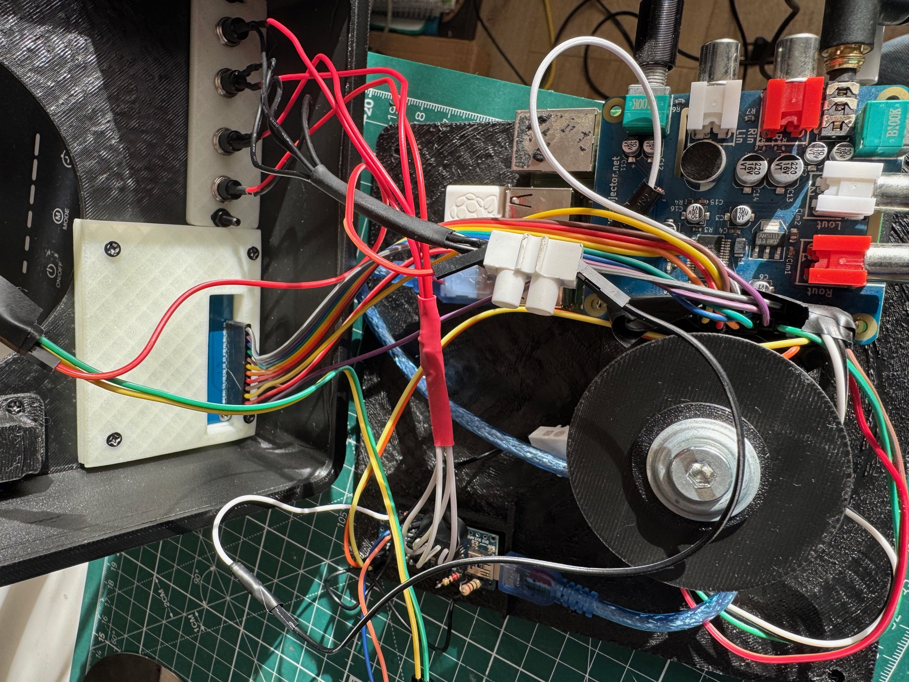
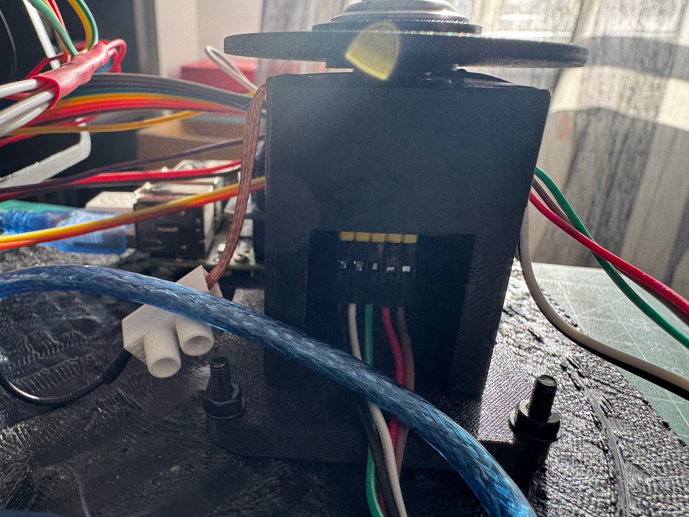

# ScratchTJ MK2: DIY Digital Turntable

A fully open-source digital turntable built on a Raspberry Pi, based on the [xwax](http://www.xwax.co.uk/) vinyl emulation engine. Scratch, mix, and perform with a touch-sensitive HDD platter, crossfader, color TFT display, and a full on-device menu system.

[](https://youtu.be/rufXcn8hjYE)

> Click the image above to watch ScratchTJ in action.

---

## What Is This?

ScratchTJ is a custom digital DJ controller inspired by [the_rasteri's SC1000](https://github.com/rasteri/SC1000). It adapts the open-source SC1000/xwax codebase to run on a Raspberry Pi with an AudioInjector sound card, adding a hardware platter, fader, buttons, and a display for a self-contained scratching instrument.

**MK2** is a major hardware and software upgrade over the original build:

| | MK1 | MK2 |
|---|---|---|
| Display | 1602A LCD (16x2 characters) | 1.8" ST7789 TFT (240x240 color) |
| Platter encoder | 600 PPR optical rotary | MT6701 14-bit magnetic (16384 CPR) |
| Touch sensing | Wire through encoder shaft | Slip ring + spring contact |
| Enclosure | Single box (Tinkercad) | 2-part modular (OpenSCAD parametric) |
| Menu system | Basic text navigation | Full graphical UI with color themes |
| Configuration | Edit config file | On-device menus + 3-slot preset system |
| GPIO | wiringPi library | Direct register access (no dependencies) |


---

## Features

- **Touch-sensitive HDD platter** -- scratch and manipulate audio by touching the metal platter
- **60mm DJ crossfader** -- hamster-switchable cut control with adjustable curve and cut point
- **240x240 color TFT display** -- real-time deck info, waveform position, cue points, and menus
- **Rotary encoder navigation** -- scroll through menus and adjust parameters
- **4 colored cue buttons** -- set, trigger, and manage cue points per deck
- **2-deck operation** -- independent control of two virtual decks
- **3-slot preset system** -- save and recall entire configurations
- **ALSA mixer integration** -- adjust sound card volume and gain from the menu
- **Recording** -- record audio input directly to WAV files
- **Fully configurable** -- all parameters adjustable in real-time through the menu system


---

## Hardware Overview



### Components

| Component | Purpose |
|---|---|
| Raspberry Pi 2/3/4 | Main computer, runs xwax |
| AudioInjector Stereo HAT | Sound card (ALSA) |
| Arduino Nano (CH340) | Reads fader + capacitive touch, serial to Pi |
| MT6701 magnetic encoder | 14-bit platter angle sensing (I2C, read by Pi) |
| 1.8" ST7789 TFT (240x240) | Color display (SPI) |
| EC11 rotary encoder | Menu navigation |
| 60mm DJ fader | Crossfader |
| HDD platter | Touch-sensitive spinning disc |
| 625 bearing (5x16x5mm) | Platter bearing |
| 4x momentary buttons | Cue point triggers (colored caps) |
| Slip ring + spring contact | Capacitive touch through rotating platter |


### I2C Bus

| Address | Device |
|---|---|
| 0x06 | MT6701 magnetic encoder (14-bit angle) |

### SPI Bus

| Device | Pins |
|---|---|
| ST7789 TFT | SPI0, DC=GPIO24, RST=GPIO25 |

### GPIO Pin Map

| Pin | Function |
|---|---|
| GPIO 22 | Rotary encoder DT |
| GPIO 23 | Rotary encoder CLK |
| GPIO 27 | Rotary encoder switch |
| GPIO 17 | KB0 button |
| GPIO 24 | TFT DC |
| GPIO 25 | TFT RST |
| TX/RX | Arduino Nano serial (fader + cap touch) |



---

## Menu System

The TFT display shows a full graphical menu with color themes, scrollbar, and real-time feedback.

### Menu Structure

```
HOME SCREEN (deck status, track info, cue bar, fader position)
  |
  +-- Deck 1
  |     +-- Load File (next/prev file, folder, random)
  |     +-- Settings (jog pitch, jog reverse)
  |     +-- Volume
  |     +-- Info (track details)
  |     +-- Record
  |
  +-- Deck 2 (same as Deck 1)
  |
  +-- Controller
  |     +-- Sound Settings (ALSA mixer params)
  |     +-- Global Settings (all shared variables)
  |     +-- Save Config
  |     +-- Reset Defaults
  |
  +-- Info (system information)
  |
  +-- Presets
        +-- Slot 1 / Slot 2 / Slot 3
        +-- Save / Load per slot
```

### Navigation

- **Rotary encoder turn** -- scroll through menu items or adjust values
- **Rotary encoder press** -- select / enter
- **KB0 short press** -- back / exit
- **KB0 long press** -- return to home screen


---

## 3D Printed Enclosure

The MK2 enclosure is a 2-part modular design created in OpenSCAD, optimized for FDM printing.

### Parts

| Part | File | Description |
|---|---|---|
| Base shell | `base_shell.stl` | Houses Pi, Arduino, encoder pedestal |
| Platter carrier | `platter_carrier.stl` | Top plate with platter opening |
| Display clamp | `display_clamp.stl` | Mounts TFT display |
| Button bar clamp | `button_bar_clamp.stl` | Holds cue buttons |
| Fader cassette | `fader_cassette.stl` | Fader mount |
| Bottom cover | `bottom_cover.stl` | Base closure |

STL files are in [docs/enclosure/stls/](docs/enclosure/stls/).

Full design documentation: [docs/enclosure/ENCLOSURE_DESIGN.md](docs/enclosure/ENCLOSURE_DESIGN.md)

---

## Bill of Materials

| Item | Qty | Notes |
|---|---|---|
| Raspberry Pi 2/3/4 | 1 | Pi 2 works, Pi 3/4 recommended |
| AudioInjector Stereo HAT | 1 | ALSA sound card |
| Arduino Nano (CH340) | 1 | Serial to Pi (500k baud) |
| MT6701 magnetic encoder | 1 | I2C 0x06, 14-bit |
| 1.8" ST7789 TFT 240x240 | 1 | SPI, 3.3V |
| EC11 rotary encoder | 1 | With push button |
| 60mm DJ fader | 1 | Linear, center detent optional |
| HDD platter (3.5") | 1 | From old hard drive |
| 625 bearing (5x16x5mm) | 1 | Standard skateboard bearing |
| 6mm magnet (6x2.5mm) | 1 | For MT6701 |
| Momentary push buttons | 4 | Colored caps (red, green, yellow, blue) |
| 1.2k ohm resistor | 1 | Capacitive touch circuit |
| Copper tape (3mm) | -- | Slip ring |
| Phosphor bronze strip | -- | Spring contact |
| DuPont connectors & wire | -- | I2C, SPI, GPIO wiring |
| M2, M2.5, M3 screws | -- | Assembly |

---

## Quick Start

### Prerequisites

- Raspberry Pi with Raspbian/Raspberry Pi OS
- AudioInjector HAT installed and configured
- Arduino Nano flashed with ScratchTJ firmware
- All hardware wired and assembled

### Build & Run

```bash
# On the Raspberry Pi
cd ~/ScratchTJ/software
make -j4
sudo LC_ALL=en_GB.utf8 nice -n -19 ./xwax
```

The `LC_ALL` locale setting is required or xwax will fail with "Could not honour the local encoding".

### Development Workflow

```bash
# From your development machine, sync and build:
rsync -avz --exclude='.git' --exclude='*.o' \
  software/ pi@<pi-ip>:~/ScratchTJ/software/

ssh pi@<pi-ip> "cd ~/ScratchTJ/software && make -j4 2>&1"
```

See [docs/INSTALLATION.md](docs/INSTALLATION.md) for full setup instructions.

---

## Software Architecture

The software is a modified fork of [xwax](http://www.xwax.co.uk/) with ScratchTJ-specific additions:

| Module | File(s) | Purpose |
|---|---|---|
| Input handler | `sc_input.c/h` | Serial protocol, I2C encoder, GPIO buttons |
| TFT driver | `st7789.c/h` | SPI framebuffer driver for 240x240 display |
| Display layer | `oled_display.c/h` | High-level drawing: menus, text, bars, themes |
| GPIO | `gpio_direct.c/h` | Direct BCM register access (no wiringPi) |
| Menu system | `lcd_menu.c/h` | Menu state machine, encoder polling |
| Main menu | `main_menu.c/h` | Home screen and top-level navigation |
| Deck menu | `deck_menu.c/h` | Per-deck controls (load, volume, record) |
| Controller menu | `controller_menu.c/h` | Sound settings, global config |
| Preset menu | `preset_menu.c/h` | 3-slot save/load system |
| Info menu | `info_menu.c` | System information display |
| Shared variables | `shared_variables.c/h` | Thread-safe config registry with save/load |

See [docs/SOFTWARE.md](docs/SOFTWARE.md) for detailed architecture documentation.

---

## Configuration

Runtime parameters are stored in `scsettings.txt` and can be edited on-device through the Controller menu.

Key settings:
- `platterspeed` -- platter-to-audio ratio (9100 = 33rpm equivalent for 14-bit encoder)
- `brakespeed` -- stop button deceleration time
- `faderopenpoint` / `faderclosepoint` -- fader hysteresis thresholds
- `pitchrange` -- pitch bend range percentage
- `buffersize` -- audio buffer size

GPIO button mapping is also configured in `scsettings.txt`.

---

## Project History

This project started as an experiment to adapt the SC1000 code for a Raspberry Pi with an AudioInjector sound card. The MK1 version used a 1602 LCD, optical encoder, and a Tinkercad enclosure. MK2 is a ground-up redesign of the hardware interface while keeping the proven xwax audio engine.

The original MK1 build is preserved at the `mk1` tag.

### Demo Videos

- [ScratchTJ Demo](https://youtu.be/rufXcn8hjYE)
- [Menu System Demo](https://youtu.be/jpz3jol8UZQ)
- [Fader and Controls](https://youtu.be/uF4GSIXVzZU)
- [MK2 Build -- testing new components](https://youtu.be/ob8X8q4Xurs)

---

## Credits

- [xwax](http://www.xwax.co.uk/) by Mark Hills -- the vinyl emulation engine
- [SC1000](https://github.com/rasteri/SC1000) by the_rasteri -- the original inspiration
- [AudioInjector](http://www.audioinjector.net/) -- Raspberry Pi sound card

---

## License

This project is based on xwax, licensed under the GNU General Public License version 2.

Kiitos paljon ja happy scratching!
