# ScratchTJ Build Guide

**A step-by-step guide to building your own portable DJ scratch instrument**

> This guide is written so that anyone can follow along. We'll explain every part, every wire, and every trick.

---

## What Are We Building?

ScratchTJ is a portable digital turntable you can use to scratch sounds like a DJ. It has two "decks" — one plays a beat loop, the other plays a scratch sample — and a crossfader lets you cut between them, just like on a real DJ setup.

Here's what it looks like when it's done:

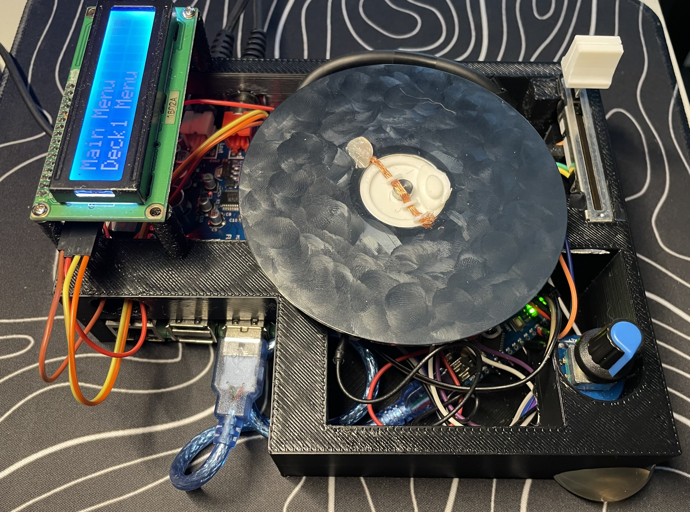

**How it works in a nutshell:**

1. You spin a **hard drive platter** (the shiny disc from inside an old hard drive)
2. An **encoder** underneath detects how fast and which direction you spin it
3. An **Arduino Nano** reads the encoder, fader, and touch sensor and sends the data to a **Raspberry Pi**
4. The **Raspberry Pi** plays audio — scratching the sound forward and backward based on how you move the platter
5. A **DJ fader** lets you cut the sound in and out
6. An **LCD screen** and **buttons** let you pick tracks and change settings

---

## Parts You Need (Bill of Materials)

Here's your shopping list. Most of these can be found on AliExpress, Amazon, or eBay.

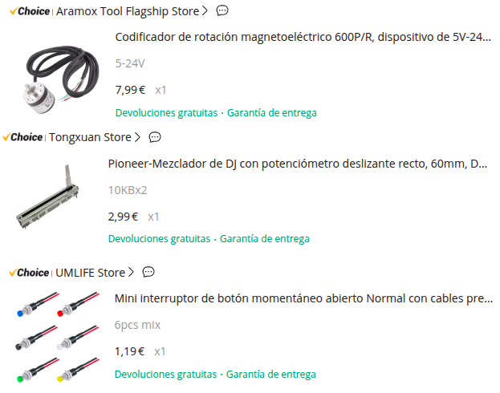

| Part | What It Does | Approx. Price |
|------|-------------|---------------|
| **Raspberry Pi 2** (or 3/4) | The brain — runs the audio software | $15-40 |
| **AudioInjector Sound Card** | I2S audio hat for high-quality sound | $20-30 |
| **Arduino Nano** | Reads the encoder, fader, and touch sensor | $3-5 |
| **600 PPR Rotary Encoder** (magnetoelectric) | Detects platter spinning — 600 pulses per revolution | $10-20 |
| **Rotary Encoder with Push Button** (small, for menu) | Navigate the LCD menu by turning and clicking | $1-2 |
| **1602A LCD Display with I2C backpack** | Shows menus, track names, settings | $2-4 |
| **DJ Crossfader** (any linear fader) | Cut between beats and scratch sample | $5-15 |
| **Hard Drive Platter** | The spinning disc you touch to scratch | Free (from old HDD) |
| **1200 Ohm Resistor** (1.2kΩ) | Used for capacitive touch sensing | $0.10 |
| **2x Push Buttons** | Enter and Back buttons for navigation + cue points | $0.50 |
| **Jumper Wires** | For all the connections | $2-3 |
| **Micro USB Cable** | Powers the Arduino from the Pi | $1 |
| **Power Supply** (5V 2.5A for Pi) | Powers the whole thing | $5-8 |

**Optional but recommended:**

- 3D printer (for the enclosure and HDD adapter)
- Soldering iron and solder
- Breadboard (for testing before soldering)
- Hot glue gun

---

## Step 1: Understanding the Big Picture

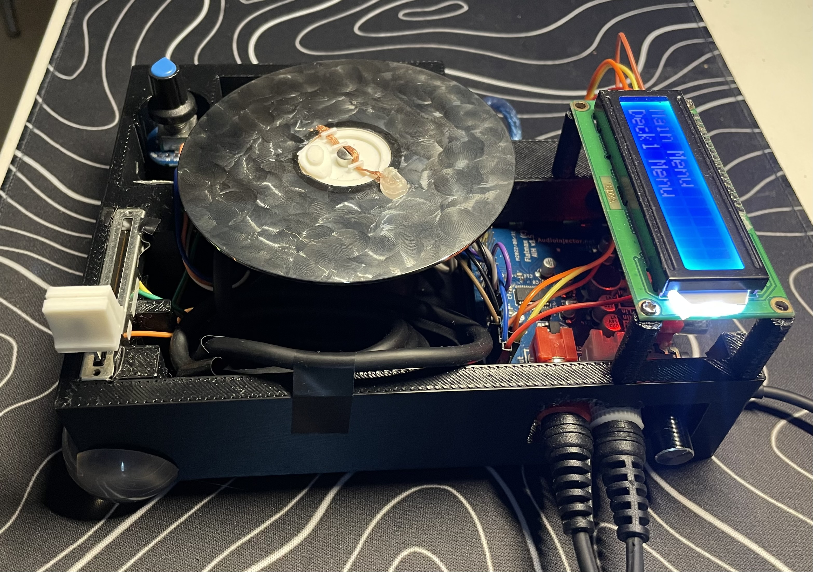

Before we wire anything, let's understand how data flows through the system:

```
┌─────────────────────────────────────────────────────────────────┐
│                        ARDUINO NANO                             │
│                                                                 │
│  ┌──────────────┐  ┌──────────┐  ┌────────────────────────┐    │
│  │ 600 PPR      │  │ DJ Fader │  │ Capacitive Touch       │    │
│  │ Encoder      │  │          │  │ (HDD Platter + 1.2kΩ)  │    │
│  │              │  │          │  │                         │    │
│  │ Pin A → D2   │  │ → A5     │  │ Send pin → D10         │    │
│  │ Pin B → D3   │  │          │  │ Sense pin → D12        │    │
│  └──────────────┘  └──────────┘  └────────────────────────┘    │
│                                                                 │
│  Sends 8-byte binary packet every 5ms (200 times per second)   │
│  over serial TX at 500,000 baud                                 │
│                                                                 │
└──────────────────────┬──────────────────────────────────────────┘
                       │ Serial (TX/RX)
                       │ 500,000 baud
                       ▼
┌─────────────────────────────────────────────────────────────────┐
│                      RASPBERRY PI                               │
│                                                                 │
│  ┌──────────┐  ┌──────────────┐  ┌──────────────────────────┐  │
│  │ xwax     │  │ LCD Menu     │  │ AudioInjector Sound Card │  │
│  │ audio    │  │ 1602A + I2C  │  │ I2S audio output         │  │
│  │ engine   │  │              │  │                           │  │
│  └──────────┘  │ I2C addr     │  │ Output → Headphones /    │  │
│                │ 0x27          │  │          Speaker          │  │
│                │              │  └──────────────────────────┘  │
│  ┌─────────────────────┐                                       │
│  │ Menu Rotary Encoder  │  ┌──────────────────┐                │
│  │ CLK → GPIO 24        │  │ 2 Buttons        │                │
│  │ DT  → GPIO 25        │  │ Enter → GPIO 17  │                │
│  │ SW  → GPIO 23        │  │ Back  → GPIO 27  │                │
│  └─────────────────────┘  └──────────────────┘                │
└─────────────────────────────────────────────────────────────────┘
```

---

## Step 2: Setting Up the Arduino Nano

The Arduino Nano is responsible for reading three sensors and sending the data to the Raspberry Pi. Let's wire them up one at a time.

### 2.1 — The 600 PPR Rotary Encoder (Platter Sensor)

This is the big encoder that goes under the platter. It has two output channels (A and B) that produce square wave signals as it spins. Because we read both channels on both rising and falling edges (called **4x quadrature decoding**), a 600 PPR encoder gives us **2400 counts per revolution** — that's incredibly precise.

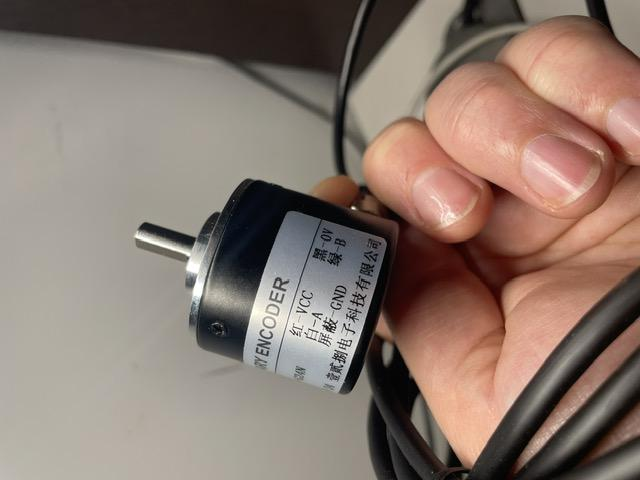

**Wiring:**

```
600 PPR Encoder          Arduino Nano
───────────────          ────────────
  Channel A  ──────────►  D2 (interrupt pin)
  Channel B  ──────────►  D3 (interrupt pin)
  VCC        ──────────►  5V
  GND        ──────────►  GND
```

> **Why pins D2 and D3?** These are the only two pins on the Arduino Nano that support hardware interrupts. An interrupt means the Arduino drops everything it's doing and immediately processes the encoder signal — this is critical for not missing any pulses while the platter is spinning fast.

> **What is quadrature encoding?** The encoder has two channels (A and B) that are 90° out of phase. By watching which channel changes first, the Arduino can tell if you're spinning clockwise or counter-clockwise. And by counting every edge on both channels (4 edges per pulse), we multiply the resolution by 4.

### 2.2 — The DJ Crossfader

The fader is a simple potentiometer (variable resistor). It outputs a voltage between 0V and 5V depending on its position.

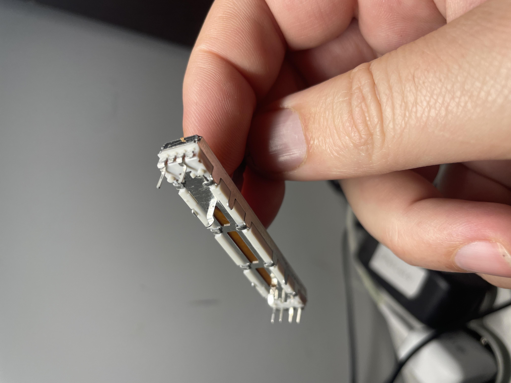

**Wiring:**

```
DJ Fader                 Arduino Nano
────────                 ────────────
  Left pin   ──────────►  GND
  Middle pin ──────────►  A5 (analog input)
  Right pin  ──────────►  5V
```

> **Tip:** If the fader direction feels backwards when you test it, you can swap the Left and Right connections, or change it in software later using the `Fad Switch` setting in the menu.

### 2.3 — Capacitive Touch Sensing (The Cool Part!)

This is the magic trick that lets the system know when your hand is touching the platter. Here's how it works:

A hard drive platter is a metal disc. Your body has a tiny amount of electrical capacitance (ability to store charge). When you touch the metal platter, the capacitance measured by the Arduino changes. The Arduino library `CapacitiveSensor` measures how long it takes to charge a small circuit through a resistor — when you touch the platter, it takes longer, and the reading goes up.

**Wiring:**

```
Arduino Nano                                    HDD Platter
────────────                                    ───────────
                    1200Ω Resistor
  D10 (send) ──────┤├──────────── D12 (sense) ──── wire to platter
```

Here's what's happening electrically:

```
   D10            1.2kΩ           D12
    │            ┌─┤├─┐            │
    │ (send)     │     │  (sense)  │
    ├────────────┘     └───────────┤
    │                              │
    │                         ┌────┴────┐
    │                         │  wire   │
    │                         │  runs   │
    │                         │ through │
    │                         │ encoder │
    │                         │  shaft  │
    │                         │    ↓    │
    │                         │  HDD    │
    │                         │ Platter │
    │                         └─────────┘
    │                              │
    │                         Your finger
    │                         touches the
    │                         metal platter
    │                         adding ~human
    │                         body capacitance
```

> **The trick:** You need a thin wire (like 1.5mm copper wire) that runs through a channel in the encoder shaft adapter, making electrical contact with the spinning HDD platter. The 3D-printed HDD adapter has channels for this wire. When the platter spins, the wire maintains contact with the platter surface.

> **The 1200Ω resistor:** This value is tuned for this specific setup. A larger resistor makes the sensor more sensitive but slower. 1200Ω gives a good balance between sensitivity and speed for DJ scratching.

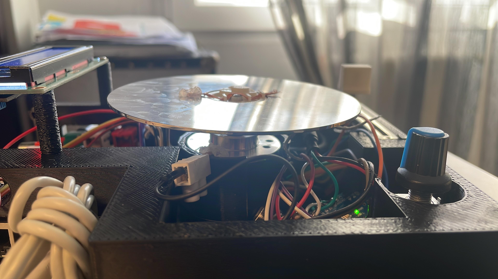

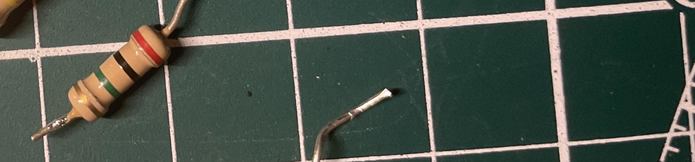

**How the readings work:**

- **Not touching:** The capacitive sensor reads a low value (maybe 100-2000)
- **Touching the platter:** The reading jumps up significantly (maybe 5000-30000)
- The software has a threshold (`cap_threshold`, default 5000) — above this means "touched"
- There's also `cap_hysteresis` (default 500) to prevent flickering at the boundary

### 2.4 — Complete Arduino Wiring Summary

```
┌─────────────────────────────────────────────┐
│              ARDUINO NANO                    │
│                                              │
│  D2  ◄── Encoder Channel A                  │
│  D3  ◄── Encoder Channel B                  │
│  D10 ──► Cap Sensor SEND (through 1.2kΩ)    │
│  D12 ◄── Cap Sensor SENSE (wire to platter) │
│  A5  ◄── Fader middle pin                   │
│  5V  ──► Encoder VCC, Fader right pin        │
│  GND ──► Encoder GND, Fader left pin         │
│  TX  ──► Raspberry Pi RX (GPIO 15)           │
│  RX  ◄── Raspberry Pi TX (GPIO 14)           │
│                                              │
└─────────────────────────────────────────────┘
```

### 2.5 — Upload the Arduino Code

1. Install the **Arduino IDE** on your computer
2. Go to **Sketch > Include Library > Manage Libraries** and search for **CapacitiveSensor** — install it
3. Open `arduino_nano/arduino_nano.ino` from the ScratchTJ project
4. Select **Tools > Board > Arduino Nano**
5. Select the correct **Port**
6. Click **Upload**

> **Testing:** Open the Serial Monitor at 500000 baud. You should see a stream of binary data (it'll look like garbage in text mode, and that's correct). If you see nothing, check your wiring.

---

## Step 3: Setting Up the Raspberry Pi

### 3.1 — Install the Operating System

1. Download **Raspberry Pi OS Lite** (no desktop needed — this project runs headless)
2. Flash it to an SD card using **Raspberry Pi Imager**
3. Boot the Pi, connect via SSH or keyboard+monitor
4. Run updates:
   ```bash
   sudo apt update && sudo apt upgrade -y
   ```

### 3.2 — Install the AudioInjector Sound Card

The AudioInjector is an I2S sound card that sits on top of the Pi's GPIO header.

1. Place the AudioInjector HAT on the Pi's GPIO pins
2. Enable I2S audio by editing `/boot/config.txt`:
   ```bash
   sudo nano /boot/config.txt
   ```
   Add this line:
   ```
   dtoverlay=audioinjector-wm8731-audio
   ```
   Comment out (add `#` before) the default audio:
   ```
   #dtparam=audio=on
   ```
3. Reboot:
   ```bash
   sudo reboot
   ```
4. Verify:
   ```bash
   aplay -l
   ```
   You should see the AudioInjector listed as a sound card.

### 3.3 — Enable the Serial Port

The Pi communicates with the Arduino over its hardware serial port (`/dev/serial0`).

1. Run `sudo raspi-config`
2. Go to **Interface Options > Serial Port**
3. Say **No** to "login shell over serial"
4. Say **Yes** to "serial port hardware enabled"
5. Reboot

Here's what the prototyping stage looks like with everything on a breadboard — Arduino, Pi, AudioInjector, LCD, encoder, and fader all wired up for testing:

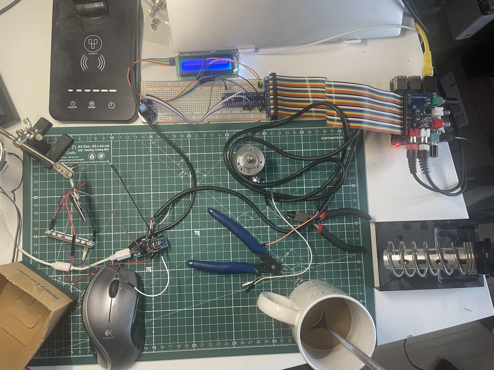

### 3.4 — Connect the Arduino to the Pi (Serial)

```
Arduino Nano             Raspberry Pi
────────────             ────────────
  TX         ──────────►  GPIO 15 (RXD)
  RX         ◄──────────  GPIO 14 (TXD)
  GND        ──────────►  GND
```

> **Important:** The Arduino Nano runs at 5V logic and the Raspberry Pi GPIO pins are 3.3V. The Pi's RX pin can tolerate 5V from the Arduino TX, but if you want to be safe, use a voltage divider (two resistors) on the Arduino TX → Pi RX line. Many people skip this and it works fine, but be aware of the risk.

> **Power:** You can power the Arduino from the Pi's 5V pin, or use a separate USB cable. Using the Pi's 5V is simpler.

### 3.5 — Wire the LCD Display (I2C)

The 1602A LCD with an I2C backpack only needs 4 wires:

```
LCD I2C Backpack         Raspberry Pi
────────────────         ────────────
  VCC          ──────────►  5V (Pin 2 or 4)
  GND          ──────────►  GND (Pin 6)
  SDA          ──────────►  GPIO 2 (SDA, Pin 3)
  SCL          ──────────►  GPIO 3 (SCL, Pin 5)
```

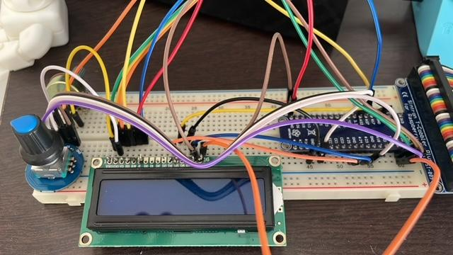

Enable I2C on the Pi:
1. `sudo raspi-config` → **Interface Options > I2C** → Enable
2. Verify with:
   ```bash
   sudo i2cdetect -y 1
   ```
   You should see address **0x27** (or 0x3F — check what your LCD uses).

### 3.6 — Wire the Menu Rotary Encoder

This is the small rotary encoder (with a click button) used to navigate the LCD menu — not the big 600 PPR platter encoder.

```
Menu Encoder             Raspberry Pi
────────────             ────────────
  CLK          ──────────►  GPIO 24
  DT           ──────────►  GPIO 25
  SW (button)  ──────────►  GPIO 23
  +            ──────────►  3.3V
  GND          ──────────►  GND
```

> **How this encoder works in the menu:** Turn it left/right to scroll through options. Click the button to go to the Home screen. Long-press the button to enter **Pitch Mode** (adjusts playback speed).

### 3.7 — Wire the Two Navigation Buttons

These two buttons are used for Enter/Back navigation in the menu, and more importantly, they become **cue point triggers** in the deck's CUE screen.

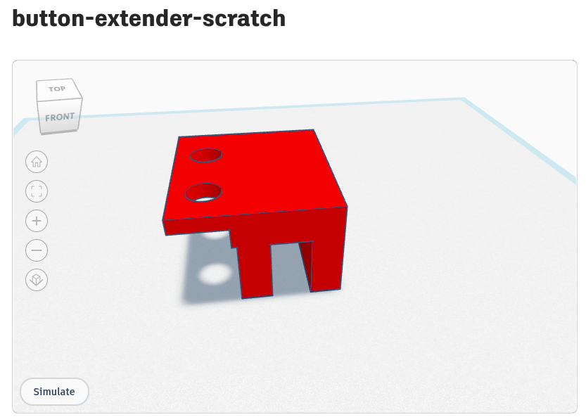

```
Buttons                  Raspberry Pi
───────                  ────────────
  Enter button  ─────────►  GPIO 17
  Back button   ─────────►  GPIO 27
  (other leg of each) ───►  GND
```

> **How the buttons work:**
> - In the **menu**: Enter selects, Back goes up one level
> - In the **CUE screen**: Each button controls its own cue point — **short press** jumps to the saved cue, **long press** sets the cue at the current position
> - Cue positions are saved per track and persist between sessions

> **Pull-up resistors:** The Pi's internal pull-up resistors are used (enabled in software), so you don't need external resistors. Just wire each button between its GPIO pin and GND.

---

## Step 4: Complete Raspberry Pi Wiring Summary

Here's every wire that connects to the Raspberry Pi:

```
┌────────────────────────────────────────────────────────────┐
│                    RASPBERRY PI GPIO                        │
│                                                             │
│  Pin 2  (5V)      ──► LCD VCC, Arduino 5V                  │
│  Pin 3  (GPIO 2)  ──► LCD SDA (I2C data)                   │
│  Pin 5  (GPIO 3)  ──► LCD SCL (I2C clock)                  │
│  Pin 6  (GND)     ──► LCD GND, Arduino GND, Buttons GND    │
│  Pin 8  (GPIO 14) ──► Arduino RX                            │
│  Pin 10 (GPIO 15) ◄── Arduino TX                            │
│  Pin 11 (GPIO 17) ◄── Enter Button                          │
│  Pin 13 (GPIO 27) ◄── Back Button                           │
│  Pin 16 (GPIO 23) ◄── Menu Encoder SW (button)              │
│  Pin 18 (GPIO 24) ◄── Menu Encoder CLK                      │
│  Pin 22 (GPIO 25) ◄── Menu Encoder DT                       │
│                                                             │
│  AudioInjector HAT sits on top of the GPIO header           │
│  (uses I2S pins internally)                                 │
│                                                             │
└────────────────────────────────────────────────────────────┘
```

> **Note:** The AudioInjector HAT plugs onto the GPIO header and uses some pins for I2S audio. It has pass-through headers so you can still access the other GPIO pins. Make sure none of your wires conflict with the AudioInjector's pins.

---

## Step 5: The 3D-Printed Parts

You need to print three parts. All models are on Tinkercad and can be printed on any standard 3D printer.

### 5.1 — HDD Platter Adapter

**[Download from Tinkercad](https://www.tinkercad.com/things/61eF1Ijn7o5-hdd-adapter?sharecode=nWsXvmSv_DllBxx8CcdytpptvyzZCUKnqFkQ3bDZFho)**

This adapter connects the HDD platter to the encoder shaft. The key feature is a **channel for the capacitive touch wire** — a thin copper wire runs through this channel, making contact with the platter so the Arduino can detect when you're touching it.

### 5.2 — Main Enclosure

**[Download from Tinkercad](https://www.tinkercad.com/things/2LCXX7xvP9b-tinkerscratchv0.1?sharecode=RHVKMN4xlvb5UvUtA5s9apYJHQghMAneHwZlXMxaT3Y)**

Houses the Raspberry Pi, Arduino, fader, LCD, and encoder. The platter encoder mounts underneath with the shaft poking through the top.

### 5.3 — Button Extender

**[Download from Tinkercad](https://www.tinkercad.com/things/4uivv2bXmRU-button-extender-scratch)**

An add-on bracket that holds the two navigation/cue buttons in a comfortable position.


---

## Step 6: Build the Software

### 6.1 — Install Dependencies

On the Raspberry Pi:

```bash
sudo apt install -y build-essential libsdl2-dev libasound2-dev wiringpi git
```

### 6.2 — Clone the Project

```bash
git clone https://github.com/no3z/ScratchTJ.git
cd ScratchTJ/software
```

### 6.3 — Compile

```bash
make
```

This compiles the xwax-based audio engine with all the ScratchTJ modifications.

### 6.4 — Add Audio Samples

Create two folders for your audio:

```bash
mkdir -p ~/samples ~/beats
```

- Put your **scratch samples** (short sounds, stabs, vocal chops) in `~/samples/`
- Put your **beat loops** in `~/beats/`

Supported format: WAV files (any sample rate, the engine will resample).

### 6.5 — Run!

```bash
cd ~/ScratchTJ/software
./xwax
```

The LCD should light up and show the main menu. You can now browse and load tracks on each deck.

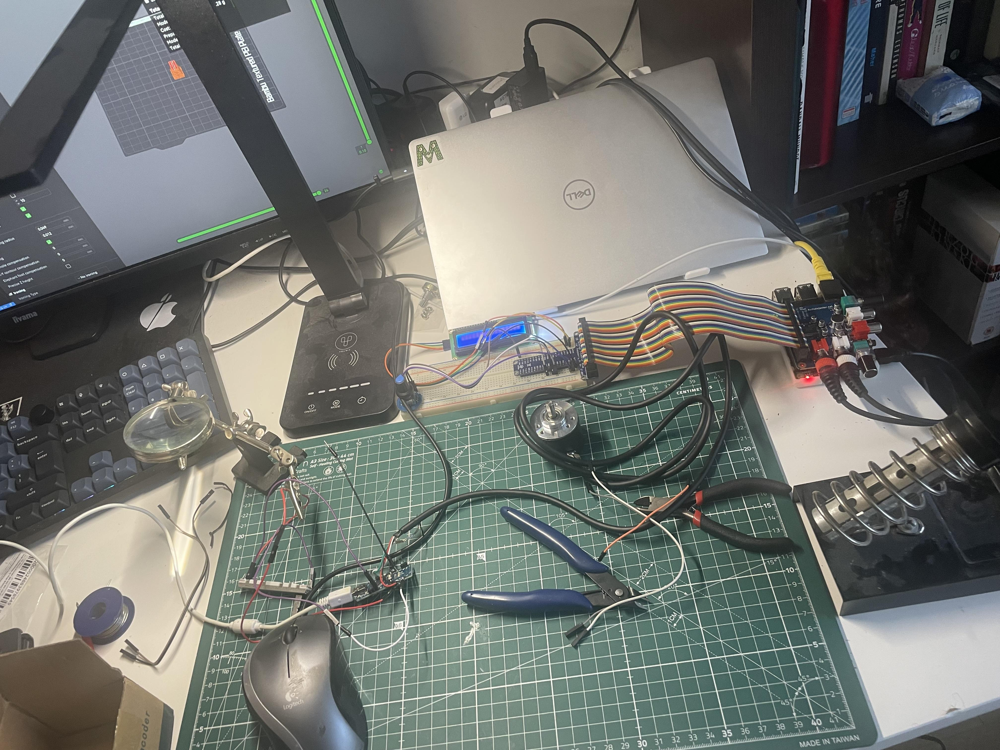

---

## Step 7: How to Use It

### Basic Scratching

1. Load a sample on **Deck 1** (Samples) using the menu
2. Load a beat on **Deck 0** (Beats)
3. Start the beat playing (use the menu or button)
4. Touch the platter and spin it — you'll hear the scratch sample move forward and backward
5. Use the crossfader to cut the scratch in and out over the beat

### Setting Cue Points

1. Navigate to a deck and select **CUE**
2. Play or scratch to the position you want
3. **Long-press** the Enter or Back button to save that position as a cue point
4. **Short-press** the same button to instantly jump back to that cue point
5. Each button has its own independent cue — so you get two hot cues per deck

### Recording Live Audio

1. Navigate to a deck and select **Record**
2. Choose your input source (from the list of available ALSA capture devices)
3. Start recording — audio from the sound card input is captured to a WAV file
4. Stop recording — the file is automatically loaded into the deck
5. You can now scratch with the audio you just recorded!

### Adjusting Settings

Go to **Config > Global Settings** to tweak parameters in real time:

- **platterspeed** (default 1333): How the encoder maps to audio position. 1333 = 33 RPM feel. Higher = faster.
- **pitch_filter** (default 0.2): Smoothness of pitch response. Lower = smoother. Higher = more responsive.
- **cap_threshold** (default 5000): The capacitive sensor level that counts as "touched." Adjust if touch detection is too sensitive or not sensitive enough.
- **slippiness** (default 200): How the virtual slipmat feels when you release the platter.

### Saving Presets

Found settings you like? Go to **Config > Presets** to save them into one of 5 preset slots. You can load them back anytime or reset to defaults.

---

## Step 8: Troubleshooting

### "The platter doesn't respond"
- Check that the encoder wires are on Arduino pins **D2** and **D3** (interrupt pins)
- Verify the Arduino is powered and the TX LED blinks every 5ms
- Check serial connection: Arduino TX → Pi GPIO 15, and Arduino RX → Pi GPIO 14
- Make sure `/dev/serial0` exists on the Pi: `ls -la /dev/serial0`

### "Touch detection doesn't work"
- Check the 1200Ω resistor is between D10 and D12
- Make sure the wire from D12 actually makes physical contact with the HDD platter
- Try adjusting `cap_threshold` in the settings (lower = more sensitive)
- Open the Arduino Serial Monitor and check if the capacitive value changes when you touch the platter

### "The LCD is blank"
- Check I2C wiring: SDA → GPIO 2, SCL → GPIO 3
- Run `sudo i2cdetect -y 1` — you should see address 0x27
- If you see 0x3F instead of 0x27, you need to change the `I2C_ADDR` define in `lcd_menu.c`
- Check that the LCD's I2C backpack contrast potentiometer is turned up

### "Audio sounds choppy or glitchy"
- Increase `buffersize` in `scsettings.txt` (try 2048 or 4096)
- Make sure no other processes are consuming CPU
- Check that the AudioInjector is properly seated on the GPIO header

### "The fader direction is backwards"
- Change the `Fad Switch` parameter to 1 (or 0) in Config > Global Settings
- Or swap the left/right wires on the fader

---

## How the Software Works (For the Curious)

If you want to understand or modify the code, here's what each file does:

| File | What It Does |
|------|-------------|
| `arduino_nano.ino` | Reads encoder (interrupts on D2/D3), fader (A5), and capacitive sensor (D10/D12). Sends 8-byte binary packets at 200 Hz over serial at 500,000 baud. |
| `sc_input.c` | Receives serial data on the Pi, decodes binary packets, calculates platter position and velocity, detects touch on/off with hysteresis. |
| `player.c` | The audio engine — uses cubic interpolation to play audio at variable speed based on platter movement. Has pitch filtering and slipmat simulation. |
| `lcd_menu.c` | Drives the I2C LCD display and handles the menu rotary encoder and buttons. Polls at 200 Hz. |
| `deck_menu.c` | Each deck's submenu: file browser, transport controls, CUE screen (with 2-button cue control), and recording. |
| `recording.c` | Captures live audio from ALSA input devices and saves to WAV. |
| `cues.c` | Manages cue points — save, load, jump. Persists cue positions to files alongside the audio tracks. |
| `shared_variables.c` | Thread-safe system for runtime-tunable parameters. The LCD menu reads/writes these in real time. |
| `preset_menu.c` | Save/load/reset all parameters across 5 preset slots stored in `~/.scratchtj/presets/`. |

### The Binary Serial Protocol

Every 5ms, the Arduino sends exactly 8 bytes:

```
Byte 0: 0xAA        (sync byte — the Pi scans for this to find packet start)
Byte 1: Fader High   (fader value, 0-1023, high byte)
Byte 2: Fader Low    (fader value, low byte)
Byte 3: Angle High   (encoder position, 0-2399, high byte)
Byte 4: Angle Low    (encoder position, low byte)
Byte 5: Cap High     (capacitive sensor value, high byte)
Byte 6: Cap Low      (capacitive sensor value, low byte)
Byte 7: Checksum     (XOR of bytes 1-6, for error detection)
```

The Pi validates every packet by checking the sync byte and XOR checksum. If communication is lost for 2 seconds, a watchdog timer triggers and auto-reconnects (with a hard DTR reset of the Arduino after 3 failures).

---

## Credits

- Based on the **[SC1000 Open Source Turntable](https://github.com/rasteri/SC1000)** by **the_rasteri**
- Audio engine from **[xwax](http://www.xwax.co.uk/)** by Mark Hills, licensed under GNU GPL v2
- Inspiration from the [SC500 DIY CDJ build](https://www.youtube.com/watch?v=j9CJ7EI0yY4)

---

**Happy scratching!** If you build one, share it — open an issue or PR on [GitHub](https://github.com/no3z/ScratchTJ).
