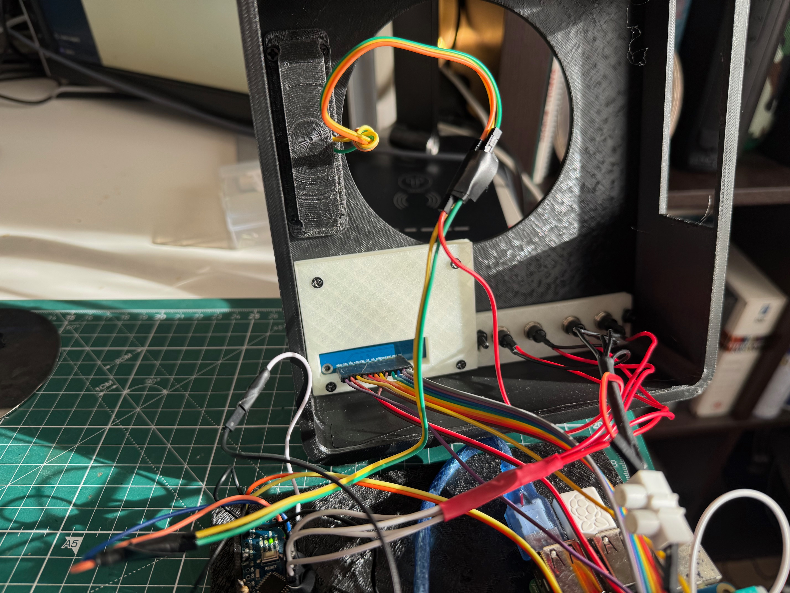
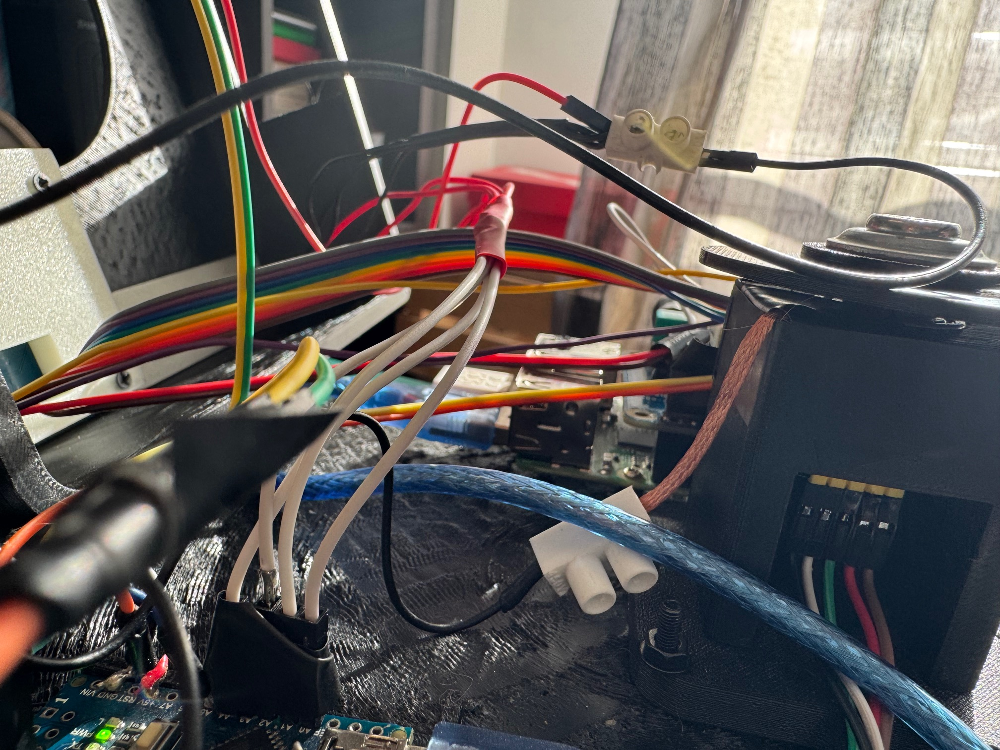

# ScratchTJ MK2 Build Guide

This guide covers the **new improved MK2 build** only.
If you are looking for the old version, use Git tag **`mk1`**.

---

## 1) Build Goal

Build a compact digital scratch deck around:

- Raspberry Pi + xwax engine
- Touch-sensitive metal platter
- Crossfader + cue buttons
- Rotary navigation + TFT menu
- MT6701 magnetic angle sensing for platter position


---

## 2) System Wiring Diagram

This is the full signal path -- every connection between components:

```
                          ┌─────────────────────────────────────────────┐
                          │              RASPBERRY PI                    │
                          │                                             │
  ┌──────────────┐        │  GPIO 2 (SDA) ◄──── I2C ────► MT6701      │
  │ AudioInjector│◄─I2S──►│  GPIO 3 (SCL) ◄─────┘         (0x06)      │
  │  Sound Card  │        │                                             │
  │  (HAT)       │        │  GPIO 10 (MOSI) ──► SPI ────► ST7789 TFT  │
  └──────────────┘        │  GPIO 11 (SCLK) ──►    │      (240x240)   │
        │                 │  GPIO 8  (CE0)  ──► CS  │                   │
     3.5mm                │  GPIO 24        ──► DC  │                   │
     jacks                │  GPIO 25        ──► RST │                   │
                          │                                             │
                          │  GPIO 22 (DT)  ◄── EC11 Rotary Encoder     │
                          │  GPIO 23 (CLK) ◄──   (menu navigation)     │
                          │  GPIO 27 (SW)  ◄──   (push button)         │
                          │                                             │
                          │  GPIO 17       ◄── KB0 Button (back)       │
                          │                                             │
                          │  GPIO 14 (TXD) ──►┐                        │
                          │  GPIO 15 (RXD) ◄──┤ UART 500kbaud          │
                          └───────────────────┼────────────────────────┘
                                              │
                                              ▼
                                    ┌─────────────────┐
                                    │  ARDUINO NANO    │
                                    │                  │
                                    │  A5 ◄── Fader    │  (60mm crossfader)
                                    │                  │
                                    │  D10 ── 1.2kΩ ──┤
                                    │  D12 ◄───────── spring contact
                                    │                     │
                                    │  A0 ◄── Cue Btn 1   │ slip ring
                                    │  A1 ◄── Cue Btn 2   │
                                    │  A2 ◄── Cue Btn 3   ▼
                                    │  A3 ◄── Cue Btn 4  HDD Platter
                                    └─────────────────┘  (user touches)
```

**Important:** The Arduino Nano TX (5V) connects to Pi RX (3.3V). Use a voltage divider or level shifter on this line to avoid damaging the Pi GPIO.

---

## 3) GPIO Pin Map

Every GPIO pin used by the system:

| Pi GPIO | Function | Protocol | Direction |
|---------|----------|----------|-----------|
| 2 | MT6701 SDA | I2C | Bidirectional |
| 3 | MT6701 SCL | I2C | Output |
| 8 | TFT CS (CE0) | SPI | Output |
| 10 | TFT MOSI | SPI | Output |
| 11 | TFT SCLK | SPI | Output |
| 14 | Arduino TX→RX | UART | Output |
| 15 | Arduino RX←TX | UART | Input |
| 17 | KB0 button (back) | GPIO | Input (pull-up) |
| 22 | Menu encoder DT | GPIO | Input |
| 23 | Menu encoder CLK | GPIO | Input |
| 24 | TFT DC | GPIO | Output |
| 25 | TFT RST | GPIO | Output |
| 27 | Menu encoder SW | GPIO | Input (pull-up) |

| Arduino Pin | Function | Notes |
|-------------|----------|-------|
| A5 | Fader | Analog read, 10-bit |
| D10 | Cap touch send | CapacitiveSensor library |
| D12 | Cap touch sense | Via 1.2kΩ to D10 |
| A0--A3 | Cue buttons 1--4 | Digital read, internal pull-up |
| TX | Serial to Pi | 500,000 baud |

---

## 4) Hardware Stack

### Main electronics
- Raspberry Pi (2/3/4)
- AudioInjector sound card/HAT
- Arduino Nano (for fader + touch signal path)
- MT6701 magnetic encoder module (I2C)
- ST7789 240x240 TFT (SPI)
- Rotary encoder (menu navigation)
- 60mm DJ-style crossfader
- Cue buttons (4x, active-low)

### Mechanical
- HDD platter and bearing support
- Slip ring/spring contact for platter touch transfer
- 3D printed MK2 enclosure parts


---

## 5) Enclosure

The enclosure is a 3D printed shell that holds all the electronics and the platter assembly. The platter opening is on top, controls face upward for natural DJ interaction.



### A note on fit

The current 3D printed enclosure design works but it is rough around the edges. M3 screws need to be forced into their holes -- expect to brute-force them in. The tolerances are not dialed in and the design could use a proper revision. That said, once the screws are in, the assembly is sturdy enough and holds up fine under scratching. It's functional, not pretty.

See [`enclosure/ENCLOSURE_DESIGN.md`](enclosure/ENCLOSURE_DESIGN.md) for full enclosure documentation.

---

## 6) Parametric Encoder Mount

The encoder mount is the core mechanical component of MK2. It holds the MT6701 magnetic angle sensor, bearing, shaft, and magnet in precise alignment. The design is fully parametric in OpenSCAD -- every dimension can be changed and the geometry recomputes automatically.

Source file: [`enclosure/parametric_encoder_mount.scad`](enclosure/parametric_encoder_mount.scad)
Pre-built STL: [`enclosure/parametric_encoder_mount.stl`](enclosure/parametric_encoder_mount.stl)


### Design overview

The mount is a three-part printed assembly plus off-the-shelf hardware:

```
        ┌─────────────────┐
        │   HDD PLATTER   │  (metal disc, user touches this)
        ├─────────────────┤
        │ PLATTER ADAPTER │  (printed, sits on cap flange)
        ├─────────────────┤
        │      CAP        │  (printed, press-fits onto bolt shaft)
        │   ┌─────────┐   │
        │   │BOLT HEAD│   │  (M5 socket head, sits on cap top)
        ├───┼─────────┼───┤
        │   │  SHAFT  │   │
        │   │ (bolt)  │   │  ← bearing press-fit zone
        │ ┌─┤         ├─┐ │
        │ │ │ BEARING │ │ │  (e.g. 625: 5mm bore, 16mm OD)
        │ └─┤         ├─┘ │
        │   │         │   │
        │   │  SHAFT  │   │
        │   │ (bolt)  │   │
        │   ├─────────┤   │
        │   │ WASHER  │   │
        │   ├─────────┤   │
        │   │   NUT   │   │  (retains bolt below bearing)
        │   ├─────────┤   │
        │   │ MAGNET  │   │  (diametric, at bolt bottom end)
        │   └────┬────┘   │
        │     air gap      │
        │   ┌────┴────┐   │
        │   │ MT6701  │   │  (PCB, slides in from below)
        │   │   PCB   │   │
        │   └─────────┘   │
        │      BASE        │  (printed, holds everything)
        └─────────────────┘
```


### The shaft: why an M5 bolt

The shaft is simply an **M5 bolt** that passes through the bearing bore. This is the key design choice:

- An M5 bolt has a 5mm shank that fits standard 625 bearings (5mm bore) with no machining
- The bolt head provides a natural stop above the cap
- A nut and washer below the bearing retain the bolt and set the vertical position
- The diametric magnet press-fits into a pocket at the bottom end of the bolt, directly above the MT6701 sensor IC

Any M5 bolt works as long as it is long enough. The minimum bolt length is computed automatically by the OpenSCAD model based on the bearing height, cap height, washer, nut, and magnet stack. With the default parameters, a 24mm M5 socket head cap screw is used.

### Bearing

The default bearing is a **625** (also called 625ZZ):
- 5mm bore (fits M5 bolt)
- 16mm outer diameter
- 5mm thick

The bearing press-fits into a seat in the base. A 0.15mm tolerance is added for a snug fit. A chamfer at the top of the seat makes insertion easier. Any bearing with a 5mm bore can be used -- just change `brg_od` and `brg_h` in the SCAD file.

### MT6701 PCB positioning

The MT6701 sensor must be positioned at a precise distance below the magnet. The datasheet specifies a 0.5--2.0mm air gap between the IC and the magnet face. The default is **1.0mm**.

The PCB slides into the base from below and rests on a ledge. The ledge height is **computed automatically** from the air gap parameter, magnet size, nut/washer stack, and bearing position. This means if you change any dimension (different bearing, different magnet thickness, different air gap), the PCB position adjusts to maintain the correct sensing distance.

The PCB pocket accommodates a 23mm x 23mm MT6701 breakout board with M2 mounting holes on 19mm spacing. There is 23mm of clearance below the PCB for DuPont connectors.

### Three printed parts

**1. Base** -- the main structure

Holds the bearing seat at the top, PCB pocket at the bottom, and M3 corner mounting holes for attaching to the enclosure. The base dimensions are computed from the PCB size plus wall thickness or bearing OD plus wall thickness, whichever is larger.

**2. Cap** -- the spinning top piece

Press-fits onto the M5 bolt shaft above the bearing. Has a flange at the top that acts as a retention surface and platter support. The bore tolerance is 0.1mm for a snug press-fit.

**3. Platter adapter** -- optional centering ring

Sits on the cap body and centers the HDD platter. Clearance fit over the cap body diameter.

### Assembly order

1. Press the bearing into the base seat
2. Attach the diametric magnet to the bottom of the M5 bolt (glue or press-fit pocket)
3. Drop the bolt through the bearing from the top
4. From below: add washer, then nut, tighten to set position
5. Slide the MT6701 PCB into the base from below (it rests on the computed ledge)
6. Press-fit the cap onto the bolt shaft above the bearing
7. Place the platter adapter on the cap, then the HDD platter on top

### Parametric dimensions

All dimensions are in the SCAD file header. The most commonly adjusted ones:

| Parameter | Default | Description |
|-----------|---------|-------------|
| `brg_bore` | 5.0mm | Bearing inner diameter (must match bolt) |
| `brg_od` | 18.5mm | Bearing outer diameter |
| `brg_h` | 5.5mm | Bearing thickness |
| `bolt_dia` | 5.0mm | Bolt shaft diameter |
| `bolt_length` | 24.0mm | Bolt length excluding head |
| `bolt_head_dia` | 12.5mm | Bolt head diameter |
| `mag_dia` | 4.0mm | Diametric magnet diameter |
| `mag_h` | 2.0mm | Magnet thickness |
| `air_gap` | 1.0mm | Gap between IC and magnet (datasheet: 0.5--2.0mm) |
| `pcb_w` / `pcb_d` | 23.0mm | MT6701 breakout board dimensions |
| `pcb_hole_spacing` | 19.0mm | M2 mounting hole spacing |
| `cap_body_dia` | 20.0mm | Cap diameter |
| `platter_dia` | 52.0mm | Platter adapter support diameter |
| `wall` | 6.0mm | Base wall thickness |

### OpenSCAD render modes

Change the `SHOW` variable at the top of the file:

| Mode | Description |
|------|-------------|
| `"assembly"` | All parts assembled with mock hardware |
| `"exploded"` | Exploded view with labels |
| `"cross_section"` | Cross-section cut through center |
| `"base"` | Base part only (for export/print) |
| `"cap"` | Cap part only |
| `"platter"` | Platter adapter only |
| `"print"` | All printed parts laid out for printing |

Set `show_mock = true` to include bearing, bolt, magnet, nut, washer, and PCB visualizations.

### Print settings

| Part | Layer height | Walls | Infill | Supports |
|------|-------------|-------|--------|----------|
| Base | 0.2mm | 3 | 20% | No |
| Cap | 0.16mm | 4 | 80% | No |
| Platter adapter | 0.2mm | 2 | 15% | No |

Use PETG for all parts -- it has better layer adhesion and heat resistance than PLA, which matters for the bearing press-fit.

---

## 7) Platter Sensing -- MT6701 Hall Sensor

MK2 uses an **MT6701 magnetic angle sensor** (Hall-based, 14-bit resolution) rather than the MK1 optical encoder.

### How it works
1. The diametric magnet rotates with the platter (attached to the M5 bolt in the encoder mount)
2. The MT6701 PCB is fixed below at a calibrated air gap
3. As the platter rotates, the sensor reads absolute angular position (0--16383)
4. Raspberry Pi reads angle data over I2C at address `0x06` (registers 0x03--0x04)
5. Software converts angle deltas into jog/scratch control for xwax

### I2C wiring

| MT6701 Pin | Pi Pin |
|------------|--------|
| VCC | 3.3V |
| GND | GND |
| SDA | GPIO 2 (SDA1) |
| SCL | GPIO 3 (SCL1) |

Verify with: `i2cdetect -y 1` -- should show `06` at address 0x06.

### Why this works well
- No slotted optical wheel needed -- just a magnet and a PCB
- 14-bit resolution (16384 steps per revolution) vs 2400 CPR on the old optical encoder
- Absolute position -- no homing or drift
- Contactless -- no mechanical wear on the sensing path
- Compact -- the entire sensor is inside the encoder mount base

### Alignment notes
- Keep the magnet centered over the sensor IC axis
- Keep the air gap consistent through full rotation (the bearing handles this)
- Avoid tilt between the magnet plane and sensor board
- Route power/noisy wires away from the I2C lines (SDA/SCL)

---

## 8) Capacitive Touch (Platter Contact)

The platter must be electrically connected to the Arduino so it can detect when the user's finger is touching the metal. Since the platter rotates freely on a bearing, a slip ring transfers the signal from the spinning platter to a fixed wire.

### Circuit

```
                     1.2kΩ
Arduino D10 ────────/\/\/\/──────── Arduino D12 ──── wire ──── spring contact
  (send)                              (sense)                       │
                                                              copper slip ring
                                                              (rotates with hub)
                                                                    │
                                                              soldered wire
                                                                    │
                                                              HDD PLATTER
                                                              (metal, user touches)
                                                                    │
                                                              user's finger
                                                              (body capacitance)
```

The Arduino `CapacitiveSensor` library sends a pulse on D10 and measures how long it takes to charge through the 1.2kΩ resistor to D12. When nobody is touching the platter, the reading is low (~100--500). When a finger touches the metal platter, body capacitance increases the charge time and the reading jumps (~5000--30000).

### Slip ring construction

The slip ring is built into the rotor hub of the encoder mount:

1. **Copper tape ring** -- 3mm wide adhesive copper tape wrapped into the groove on the rotor hub (full circle, overlapping ends)
2. **Wire from ring to platter** -- a thin wire soldered to the copper ring, routed through the hub's wire channel to the platter contact point on the flange
3. **Spring contact** -- a phosphor bronze strip (0.1--0.2mm thick, 3mm wide) mounted in a fixed holder, curved tip pressing against the copper ring as it spins
4. **Wire from spring to Arduino** -- soldered to the flat end of the spring strip, connects to D12

### Touch thresholds

Configured via the on-device menu (Config > Global Settings):

| Parameter | Default | Description |
|-----------|---------|-------------|
| `cap_threshold` | 5000 | Reading above this = touched |
| `cap_hysteresis` | 500 | Band between touch-on and touch-off to prevent flicker |

Touch state gates scratch behavior -- platter movement only affects audio when the platter is being touched (depending on mode).



---

## 9) Arduino Nano

The Arduino Nano handles the DJ crossfader (analog on A5), capacitive touch sensor (D10/D12), and 4 cue buttons (A0--A3). It sends all data to the Pi over serial.


The Nano sits in a friction-fit 3D printed cradle inside the enclosure. The USB port remains accessible from the side for firmware updates.

### Serial connection

| Arduino Pin | Pi Pin | Notes |
|-------------|--------|-------|
| TX | GPIO 15 (RXD) | **Needs level shifter** (5V → 3.3V) |
| RX | GPIO 14 (TXD) | OK direct (3.3V is valid HIGH for 5V Arduino) |
| GND | GND | Common ground |

Baud rate: **500,000**. Disable the Pi serial console in `raspi-config` but keep the hardware UART enabled.

### Packet format (7 bytes)

```
Byte:  [0]     [1]     [2]     [3]     [4]     [5]       [6]
       SYNC    fHi     fLo     capHi   capLo   buttons   XOR
       0xAA    ──fader──       ──cap touch──    4-bit     checksum
               (10-bit)        (16-bit)         bitfield  (bytes 1-5)
```

Handshake: Pi sends `0x53` ('S'), Arduino replies `'T'`. Watchdog on the Pi detects 2-second timeouts with DTR hard-reset of the Arduino after 3 consecutive failures.

### Flashing

1. Connect Nano via USB
2. Open `arduino_nano/arduino_nano.ino` in Arduino IDE
3. Install `CapacitiveSensor` library
4. Select board: **Arduino Nano** (ATmega328P, Old Bootloader for CH340 clones)
5. Upload

Both the Arduino firmware and Pi software must be updated together since they share the binary serial protocol.

---

## 10) TFT Display (ST7789)

The ST7789 240x240 TFT replaces the MK1's 1602A LCD. It connects over SPI.

### Wiring

| TFT Pin | Pi Pin |
|---------|--------|
| VCC | 3.3V |
| GND | GND |
| SCL | GPIO 11 (SPI0_SCLK) |
| SDA | GPIO 10 (SPI0_MOSI) |
| DC | GPIO 24 |
| RST | GPIO 25 |
| CS | GPIO 8 (SPI0_CE0) |
| BLK | 3.3V (or GPIO for dimming) |

Enable SPI in `raspi-config`. Test with: `make test_tft_ui && sudo ./test_tft_ui`

---

## 11) Menu Encoder and Buttons

### EC11 rotary encoder (menu navigation)

| Encoder Pin | Pi Pin |
|-------------|--------|
| CLK | GPIO 23 |
| DT | GPIO 22 |
| SW (push) | GPIO 27 |
| GND | GND |

Rotation scrolls menu items. Push button confirms selection. Long-press enters Pitch Mode.

### KB0 button

| Button | Pi Pin |
|--------|--------|
| KB0 (back) | GPIO 17 |

Short press = back/exit. Long press = return to home screen. Active-low with internal pull-up.

### Cue buttons (on Arduino)

| Button | Arduino Pin |
|--------|-------------|
| Cue 1 | A0 |
| Cue 2 | A1 |
| Cue 3 | A2 |
| Cue 4 | A3 |

Active-low with internal pull-ups. Button states are sent to the Pi as a 4-bit bitfield in byte 5 of the serial packet. In the Cue screen: short press = jump to cue point, long press = set cue point at current position.

---

## 12) Fader

The DJ crossfader connects to Arduino analog pin A5. The 10-bit ADC reading (0--1023) is sent to the Pi as bytes 1--2 of the serial packet. Software applies a configurable fader curve (factor, power, direction) to map the raw value to audio crossfade.

The current build uses a cheap 60mm DJ fader. It works, but a professional fader would be a significant upgrade for scratch feel and cut precision.

Good options:
- **Innofader PNP** -- contactless magnetic fader, zero bleed, extremely precise cut-in
- **Jesse Dean JDDX2RS-A** -- popular in the portablist community, tight cut-in, reliable

Either would require redesigning the fader support (the 3D printed part that holds the fader in the enclosure). The fader slot dimensions and mounting hole pattern differ from the generic 60mm fader, so a new support piece would need to be modeled. This is a relatively contained change -- the rest of the enclosure and electronics stay the same, only the fader mount geometry changes.

---

## 13) Software Build

```bash
cd ~/ScratchTJ/software
make -j4
sudo LC_ALL=en_GB.utf8 nice -n -19 ./xwax
```

For full installation instructions (packages, interfaces, AudioInjector setup, ALSA config, audio file preparation), see [`INSTALLATION.md`](INSTALLATION.md).

---

## 14) Validation Checklist

After assembly, verify each subsystem:

| Check | How to verify |
|-------|---------------|
| Platter spins freely | Spin by hand, no rubbing or grinding |
| MT6701 detected | `i2cdetect -y 1` shows `06` |
| MT6701 angle changes | `i2cget -y 1 0x06 0x03 w` changes as you spin |
| Touch works | Serial monitor shows cap values jump on touch |
| Fader works | Serial monitor shows fader bytes change |
| Cue buttons work | Serial monitor shows button bitfield change |
| TFT displays | `sudo ./test_tft_ui` shows test pattern |
| Audio output | `aplay -l` shows AudioInjector, `speaker-test` produces sound |
| Menu responds | Encoder rotates through menu, KB0 exits |
| Scratching works | Load a track, touch platter, move it, hear audio respond |


---

## 15) Share Your Build

When your build is ready, post it:

- **Reddit**: build log + scratch clip, mention ScratchTJ MK2 and link this repo
- **Discord**: 15--45s scratch demo, wiring photo, key settings (buffer, platter speed, touch threshold)
