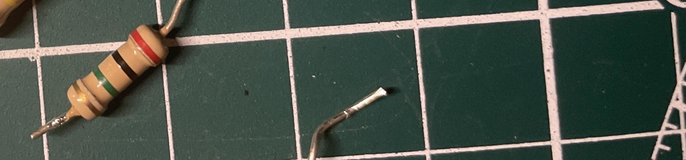
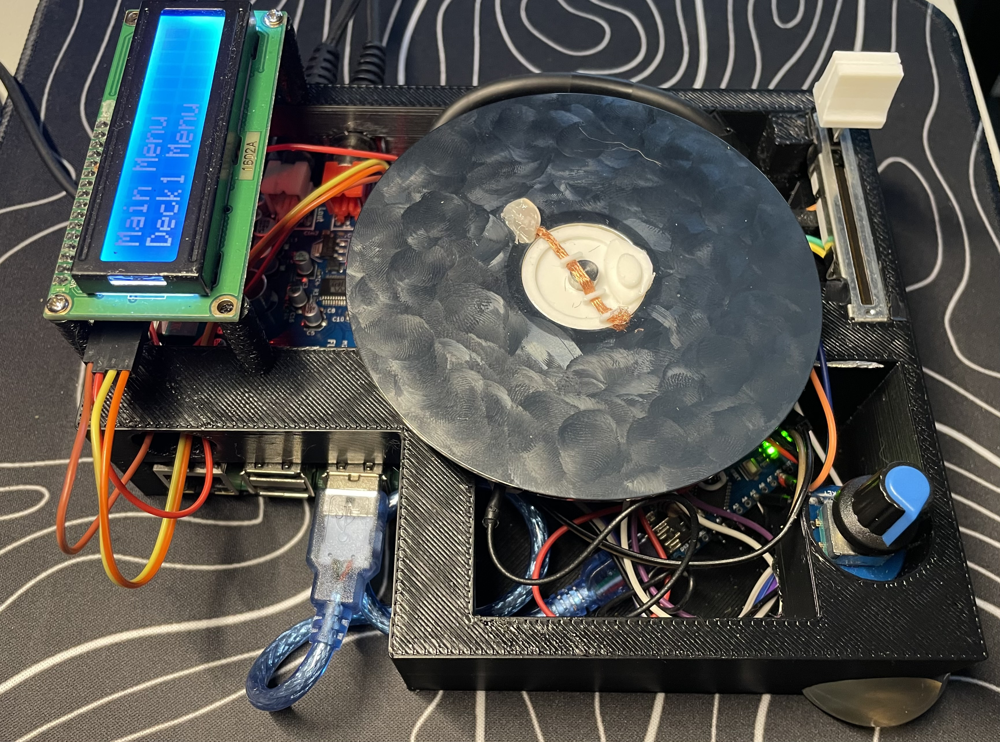
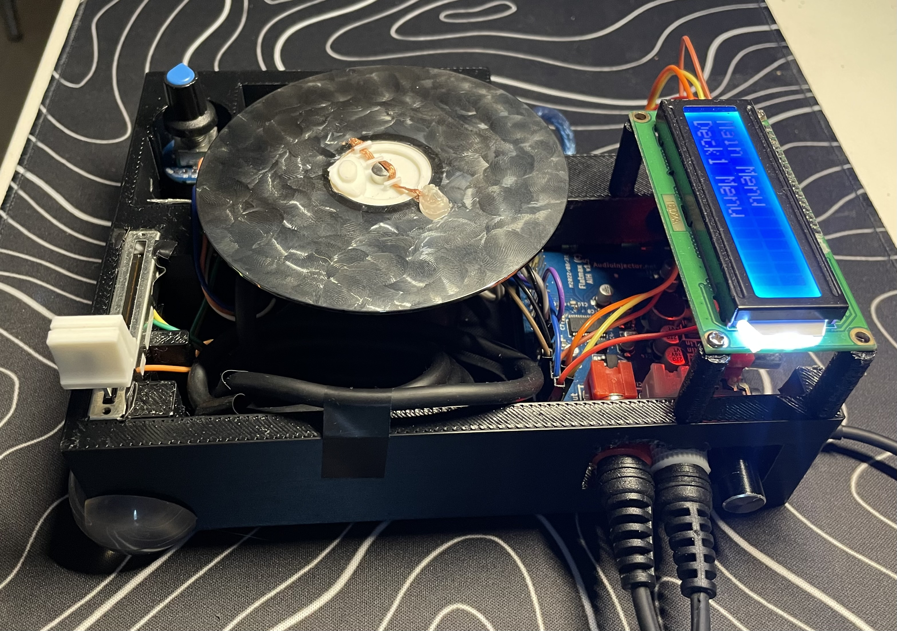
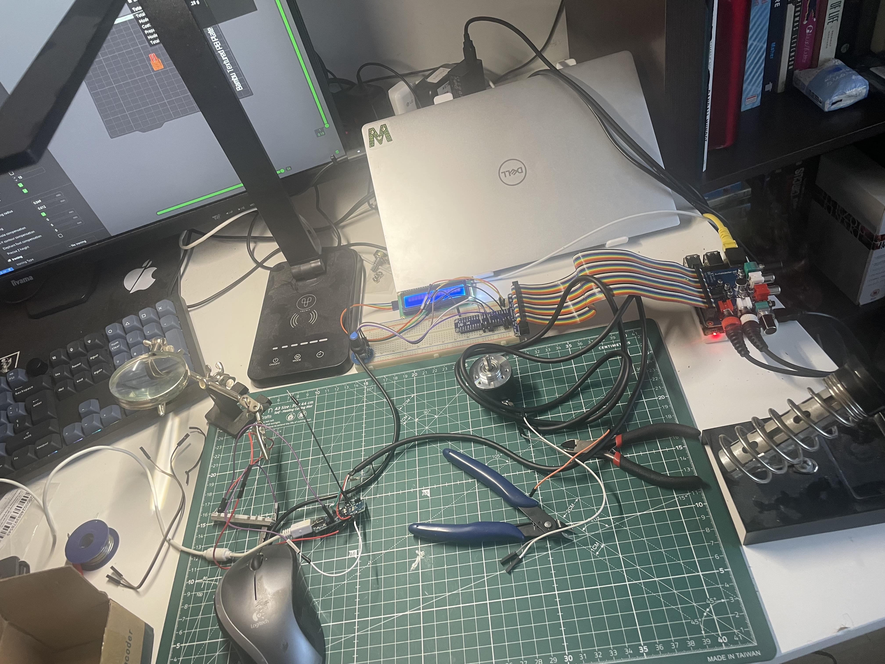

# ScratchTJ MK2 Build Guide

This guide covers the **new improved MK2 build** only.
If you are looking for the old version, use Git tag **`mk1`**.

---

## 1) Build Goal

Build a compact digital scratch deck around:

- Raspberry Pi + xwax engine
- Touch-sensitive metal platter
- Crossfader + cue buttons
- Rotary navigation + TFT menu
- MT6701 magnetic angle sensing for platter position

---

## 2) Latest MK2 Images (Recent Set)






---

## 3) Hardware Stack

### Main electronics
- Raspberry Pi (2/3/4)
- AudioInjector sound card/HAT
- Arduino Nano (for fader + touch signal path)
- MT6701 magnetic encoder module (I2C)
- ST7789 240x240 TFT (SPI)
- Rotary encoder (menu navigation)
- 60mm DJ-style crossfader
- Cue buttons

### Mechanical
- HDD platter and bearing support
- Slip ring/spring contact for platter touch transfer
- 3D printed MK2 enclosure parts

---

## 4) Platter Support + Hall Sensor Design (How MK2 Was Done)

This is one of the key MK2 upgrades.

### Mechanical support approach
1. A bearing-backed platter support holds the HDD platter so it spins smoothly.
2. The rotating platter is mechanically decoupled enough to reduce wobble and drag.
3. Enclosure mounting keeps the encoder/magnet alignment stable under scratching force.

### Hall-sensor angle sensing approach
MK2 uses an **MT6701 magnetic angle sensor** (a Hall-based magnetic encoder) rather than the older optical approach.

1. A small diametric magnet is fixed to the rotating platter axis.
2. The MT6701 board is mounted beneath/near that axis at a fixed gap.
3. As the platter rotates, the sensor reads absolute angular position (14-bit resolution).
4. Raspberry Pi reads angle data over I2C (device address `0x06`).
5. Software converts angle delta + direction into jog/scratch control for xwax.

### Why this works well
- No slotted optical wheel needed
- Better effective angular detail for scratch control
- More compact and cleaner wiring in the MK2 enclosure
- Lower mechanical complexity in the sensing path

### Practical alignment notes
- Keep magnet centered over the sensor axis
- Keep air gap consistent through full rotation
- Avoid tilt between magnet plane and sensor board
- Route motor/noisy signal wires away from I2C lines where possible

---

## 5) Touch Path (Platter Contact)

The platter touch signal is carried from the rotating metal platter using a slip-contact method.

- Copper contact path on rotating section
- Spring contact on fixed section
- Signal goes to Arduino touch-capable input path
- Arduino sends touch state to Pi over serial

Touch state gates scratch behavior, so platter movement affects audio only when touch is active (depending on settings).

---

## 6) Software Build

```bash
cd ~/ScratchTJ/software
make -j4
sudo LC_ALL=en_GB.utf8 nice -n -19 ./xwax
```

If you need first-time setup details, use [`docs/INSTALLATION.md`](INSTALLATION.md).

---

## 7) Validation Checklist

- Platter spins freely with no rubbing
- MT6701 returns stable angle values
- Direction changes follow hand motion correctly
- Touch engage/disengage is reliable
- Fader cuts audio cleanly
- Menu controls respond on TFT + rotary

---

## 8) Publish Your Build (Reddit + Discord)

When documentation and demos are ready, post:

### Reddit post suggestion
- Title example: `ScratchTJ MK2 build log + scratch demos (Raspberry Pi + xwax)`
- Include: top/internal photos, short demo clip, and one paragraph on the Hall-sensor platter upgrade.

### Discord post suggestion
- Share a 15–45s scratch clip
- Add a wiring snapshot + menu clip
- Include key settings (buffer, platter speed scale, touch threshold)

---

## 9) Questions I Need From You Before Final Public Push

Please confirm these so I can tune docs further if you want:

1. Which Raspberry Pi model did you use for your best current MK2 performance demo?
2. Do you want me to add an explicit “parts buy list” section with preferred links/vendors?
3. Should I add a troubleshooting section for Hall-sensor jitter and touch false triggers?
